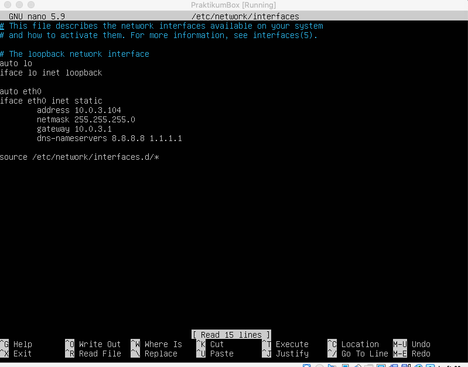
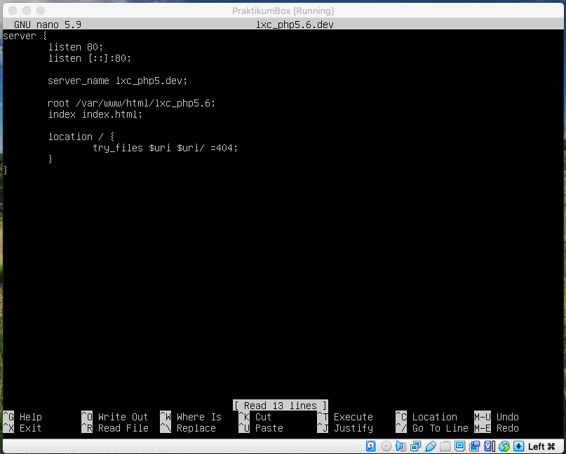

# Praktikum 1 Virtualisasi
## Linux Container Commands Tab
```bash
lxc-ls
lxc-start
lxc-start
lxc-console
lxc-stop
lxc-clone 
lxc-create
lxc-destroy
lxc-execute
lxc-attach
lxc-monitor
lxc-wait
lxc-info
lxc-freeze
lxc-unfreeze
lxc-netstat
lxc-ps
```
1. Rename ubuntu_php5.6 menjadi ubuntu_landing, serta rubah IP mengikuti skema yang baru.

2. Install lxc debian 9 dengan nama debian_php5.6
  - Kunjungi https://uk.images.linuxcontainers.org/ untuk melihat image yang akan dibuat.
  - installation command
```bash
sudo lxc-create -n debian_php5.6 -t download -- --dist debian --release sid --arch amd64 --no-validate --server uk.images.linuxcontainers.org
```


3. Setup nginx pada debian_php5.6 untuk domain http://lxc_php5.dev , buat halaman index.html yang menerangkan informasi nama lxc
  - Static ip debian_php5.6
```bash nano /etc/network/interfaces
```

  - Setting Nginx Debian
```bash 
cd /etc/nginx/sites-available
nano lxc_php5.6.dev
```

```bash cd /etc/nginx/sites-available
touch lxc_php5.6.dev
nano lxc_php5.6.dev
```


