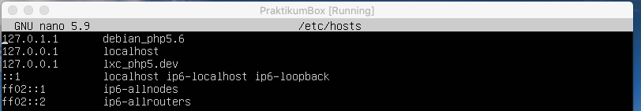

# Praktikum 1 Virtualisasi
*M Mugi Fakip Anugrah & Kevin Surya [group 14]*
## Linux Container Commands Tab
```bash
lxc-ls
lxc-start
lxc-start
lxc-console
lxc-stop
lxc-clone 
lxc-create
lxc-destroy
lxc-execute
lxc-attach
lxc-monitor
lxc-wait
lxc-info
lxc-freeze
lxc-unfreeze
lxc-netstat
lxc-ps
```
1. Rename ubuntu_php5.6 menjadi ubuntu_landing, serta rubah IP mengikuti skema yang baru.


```bash
sudo lxc-copy -n ubuntu_php5.6 ubuntu_landing
```

------
2. Install lxc debian 9 dengan nama debian_php5.6


  - Kunjungi https://uk.images.linuxcontainers.org/ untuk melihat image yang akan dibuat.
  - installation command
```bash
sudo 
lxc-create -n debian_php5.6 -t download -- --dist debian --release sid --arch amd64 --no-validate --server uk.images.linuxcontainers.org
```

------
3. Setup nginx pada debian_php5.6 untuk domain http://lxc_php5.dev , buat halaman index.html yang menerangkan informasi nama lxc


  - Static ip debian_php5.6
```bash 
nano /etc/network/interfaces
```

  - Setting Nginx Debian
```bash 
cd /etc/nginx/sites-available
nano lxc_php5.6.dev
```

```bash
nano /etc/hosts
```

```bash
cd /var/www/html/lxc_php5.6
nano index.php
```

------

4. Config nginx ubuntu_landing
  -attach ke ubuntu landing dengan command
```bash
sudo lxc-attach -n ubuntu_landing
```
step by step bisa dilihat di showcase berikut


Configurasi hosts ubuntu_landing


------

5. Set Auto Start ubuntu_landing

  - Edit config file ubuntu_server
````bash
sudo su
cd /var/lib/lxc/ubuntu_server
````


  - ubuntu_landing autostarted success (sorry 😥 i made a typo on roofs -> rootfs inside config)


------

6. Setup nginx pada vm.local untuk mengatur proxy_pass
   - mengakses http://vm.local akan diarahkan ke http://lxc_landing.dev
   - mengakses http://vm.local/blog akan diarahkan ke http://lxc_php7.dev
   - mengakses http://vm.local/app akan diartahkan ke http://lxc_php5.dev


------

7. Untuk kebutuhan presentasi mereka, browser di laptop mereka harus dapat mengakses ketiga url tersebut.

  - Test curl didalam ubuntu server.


  - Test di browser.

Landing Page
http://vm.local


App Page
http://vm.local/app


Blog Page
http://vm.local/blog


------

8. Analisis

  - Mengapa untuk kebutuhan php5.6 tidak bisa menggunakan ubuntu 16.04, sehingga perlu diganti os ke debian 9?

Linux Ubuntu 16.04 untuk php5.6 sudah sampai pada akhir LTS nya (long time service) berakhir pada **30 april 2021** kecuali melalui Extended Security Maintenance tahunan berbayar. sedangkan debian 9 masih disupport hinga 2022

  - Kenapa harus menggunakan virtualisasi LXC pada skema website yang akan didevelop?

Virtualisasi menggunakan LXC sangat ringan dan mudah dalam mengelola server.


Proxy server dapat menjadi penyedia port jaringan pengguna internet. vm.local yang kita buat pada praktikum ini bisa disebut proxy server karena vm.local agar os dapat mengakses langsung website di browser komputer lokal.
