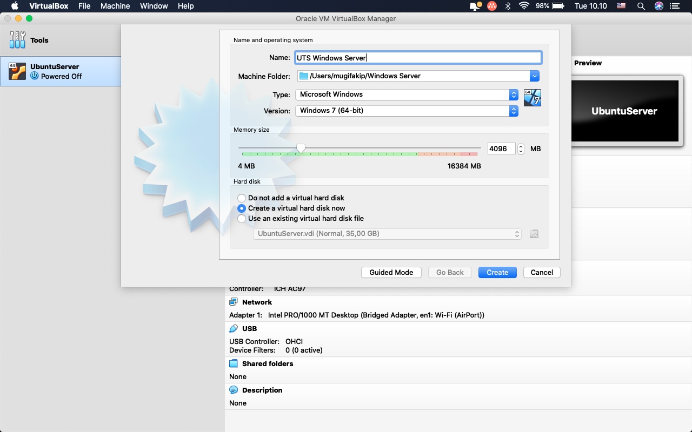
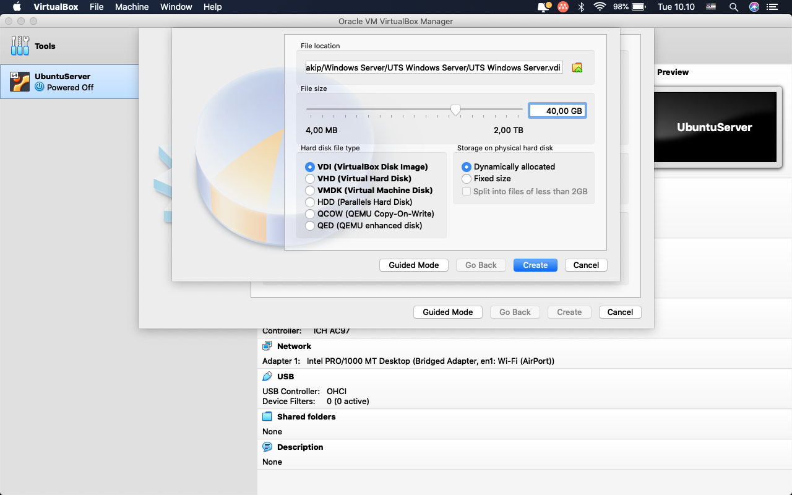
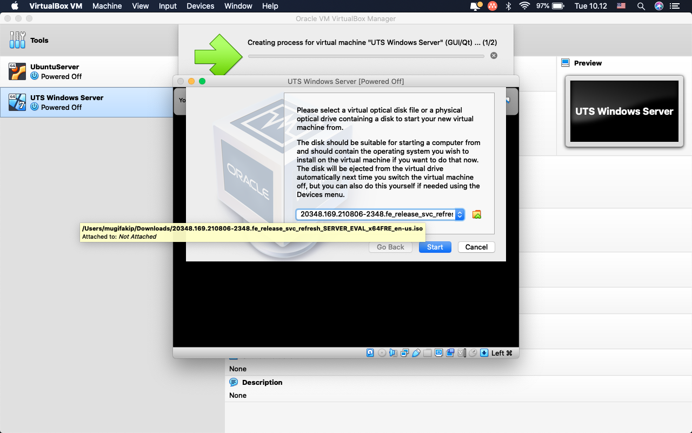
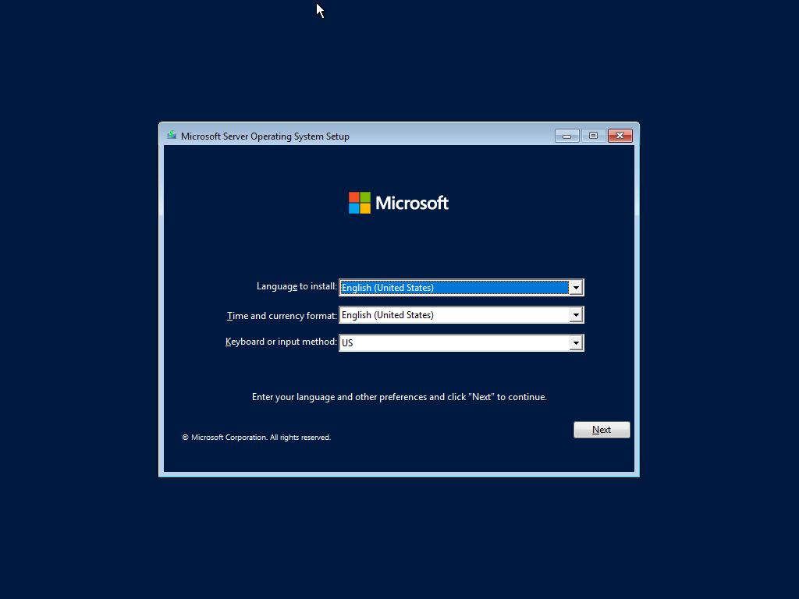

# Mid Term Exam
*Muhammad Mugi Fakip Anugrah - 1202200049
## Installation Windows Server 2022
1. Create Virtual Box untuk Windows Server
  - Type Microsoft Windows
  - Version Other Windows (64bit)
  - Ram set to 4096 Mb
  - Create Button

2. Create Vartisi di Virtualbox
  - Hardisk type : VDI (VirtualBox Disk Image)
  - Storage Physical Hardisk (Dynamically Allocated)
  - Create Button

3. Attach ISO Windows Server 2022
  - Select Windows Server 2022 we just downloaded
  - Start Button

5. Booting Windows Server 2022 ISO
  - Pick Language, time, currency format and Keyboard layout.
  - Next Button

6. 
