# Mid Term Exam
*Muhammad Mugi Fakip Anugrah - 1202200049
## Installation Windows Server 2022
1. Create Virtual Box untuk Windows Server
  - Type Microsoft Windows
  - Version Other Windows (64bit)
  - Ram set to 4096Mb
  - Create Button

2. Create Vartisi di Virtualbox
  - Hardisk type : VDI (VirtualBox Disk Image)
  - Storage Physical Hardisk (Dynamically Allocated)
  - Create Button

3. Attach ISO Windows Server 2022
  - Select Windows Server 2022 we just downloaded
  - Start Button

5. Booting Windows Server 2022 ISO
  - Pick Language, time, currency format and Keyboard layout.
  - Next Button

6. Start Installation
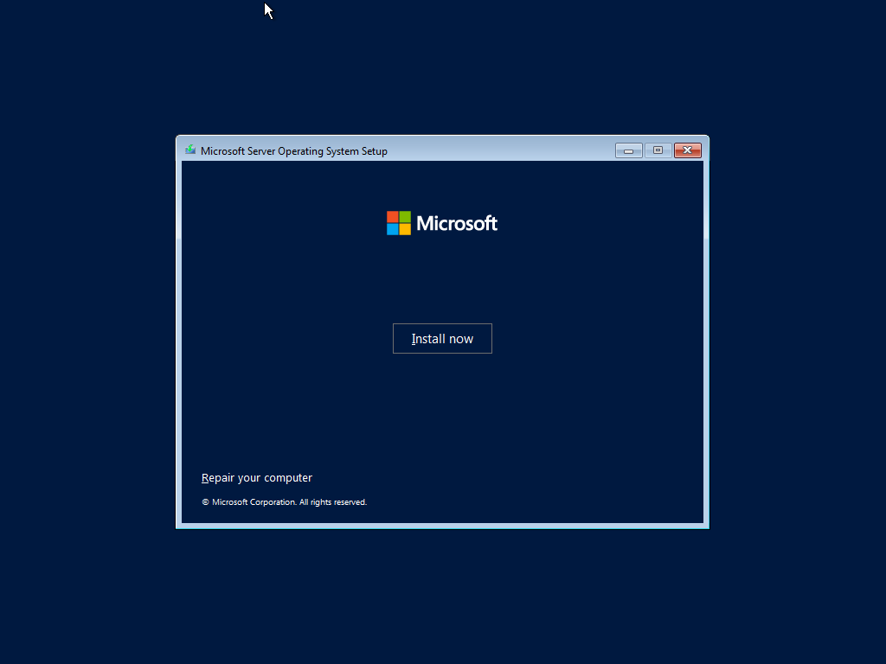

7. Preparing
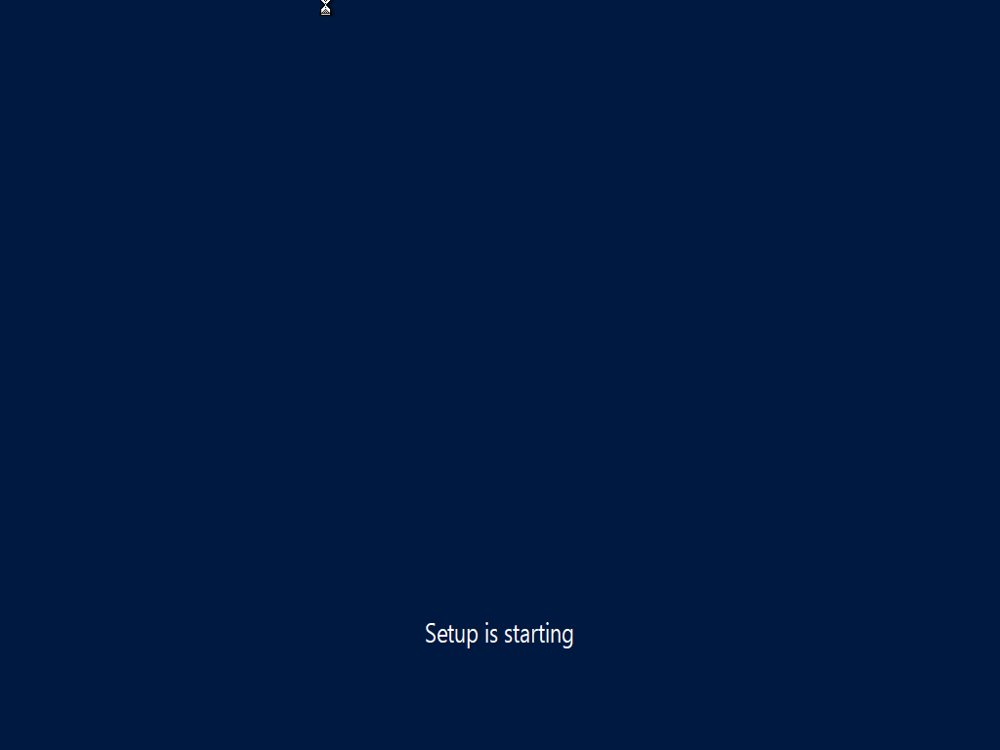

8. Select Operating System
  - In this case i will install Windows Server 2022 Standard Evaluation
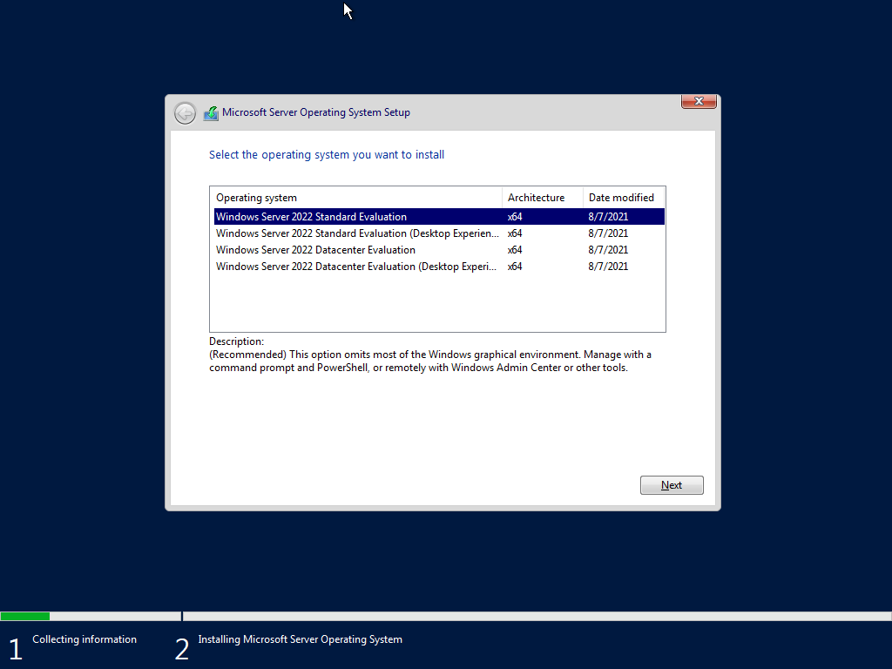

9. Accept Microsoft license term agreement
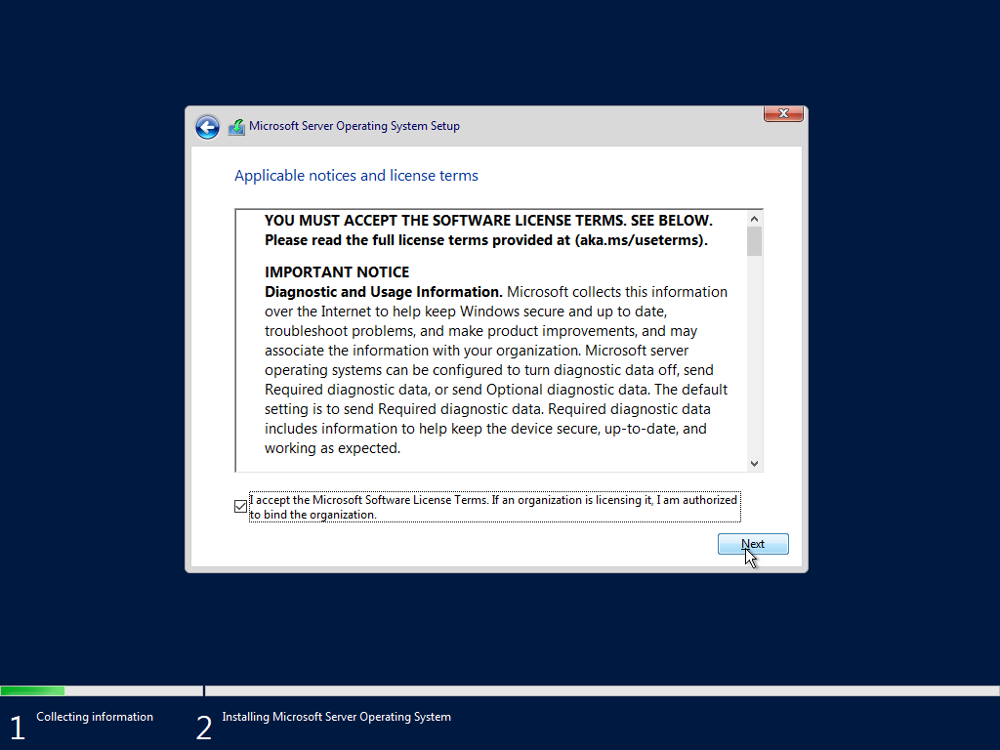

10. Select type of installation
  - In this case i will use custom installation so you will configure manually
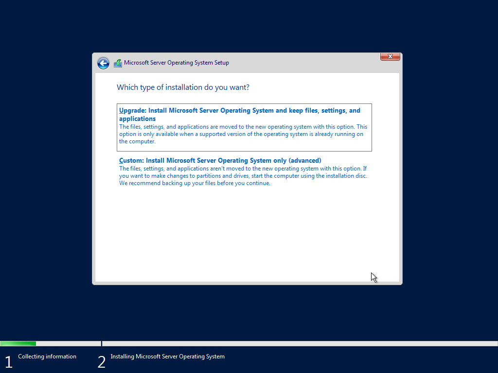

11. Partition Configuration
  - You will see the partition you have created in virtual box at point no 2 (40Gb)

12. Select New button to format unallocated partition
  - set everything we only create one partition, you can split the partition in this stage
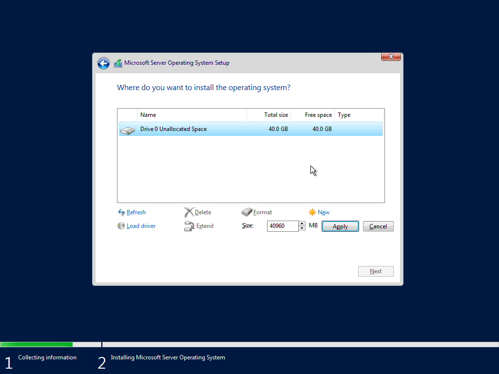

13. Select primary partition you just created
  - Under type of partition you will see primary
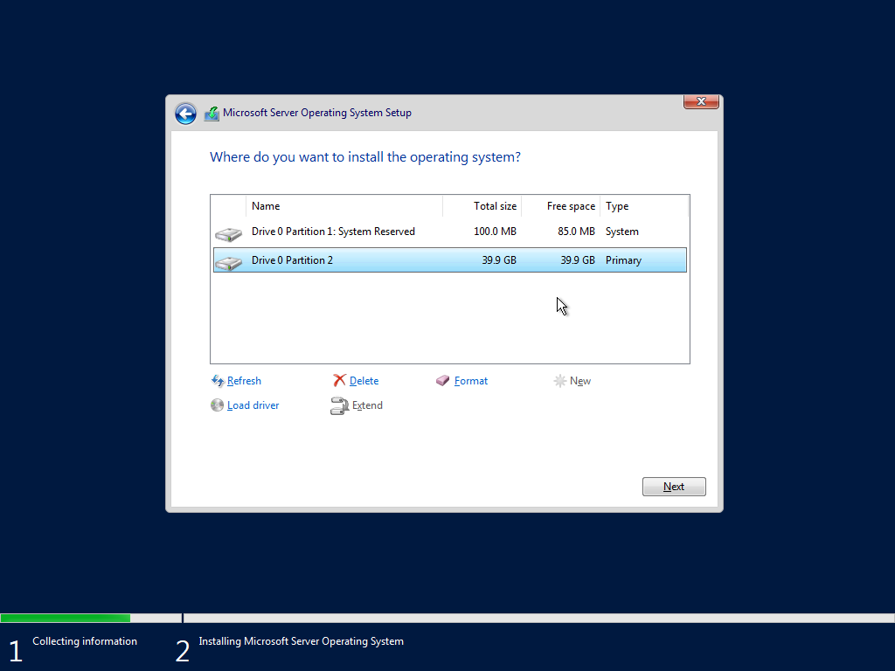

14. Installation process begin
  - Wait until all the process finish
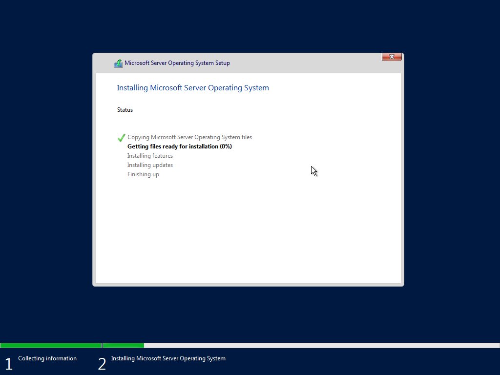

15. Start Windows Server 2022
  - After reboot, set your administrator 
  - Hit OK
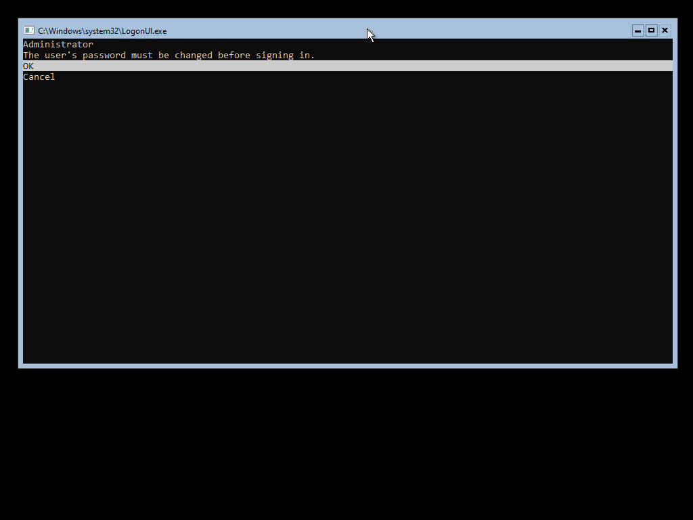

16. New password field will appear
  - Set password with Uppercase, lowercase, and number on your password
  - Hit OK
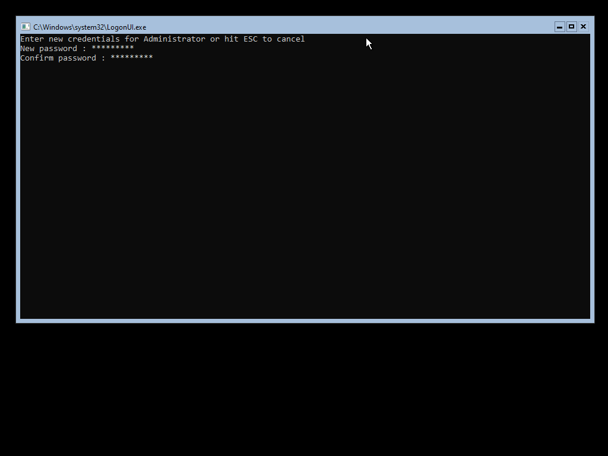

17. Password configuration success
  - Hit OK
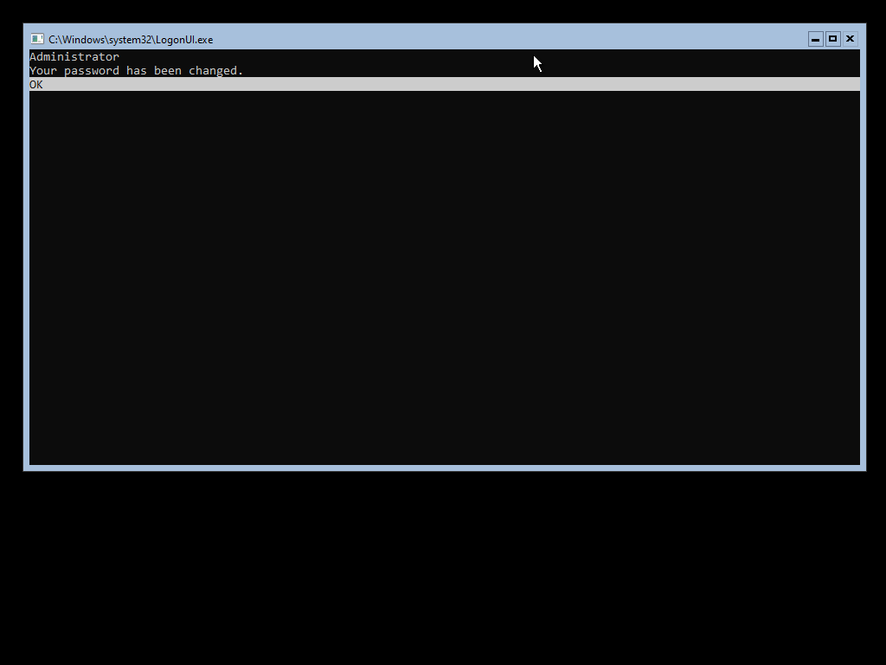

18. Welcome to Windows Server 2022
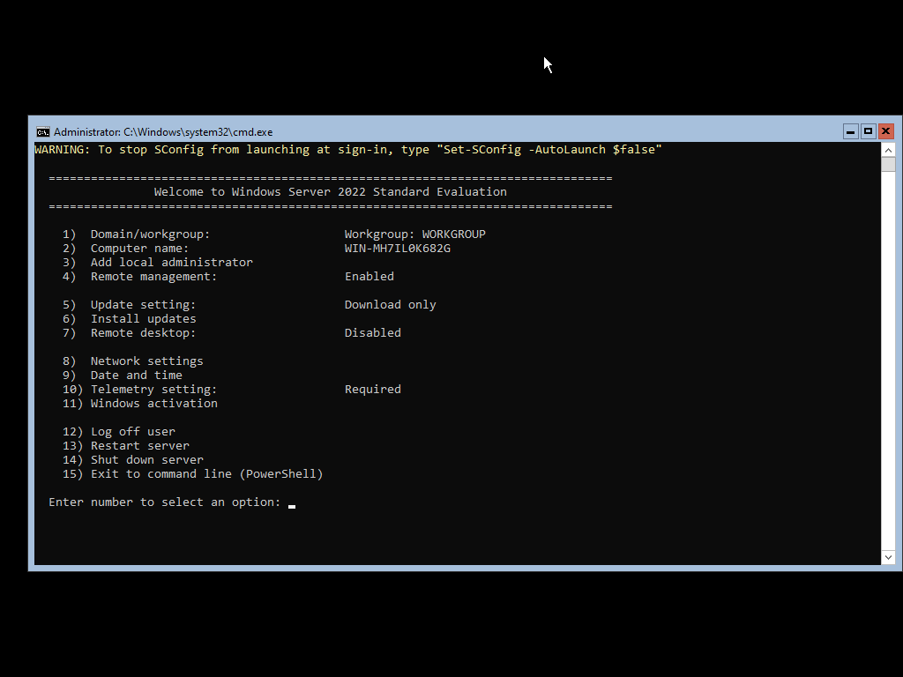

